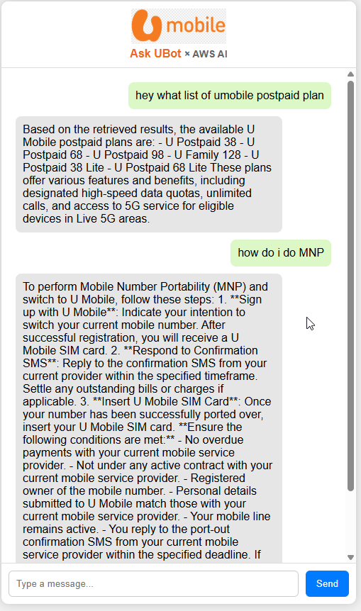

# Ask UBot × AWS AI 🤖⚡

A lightweight web-based chatbot powered by **AWS Bedrock** and **U Mobile's Knowledge Base**, styled like ChatGPT. Users can type in questions about U Mobile services such as postpaid plans, coverage, and Mobile Number Portability (MNP), and receive real-time AI responses.

---

## 📸 Preview




---

## 🔧 Features

- 🔗 Integrated with AWS Lambda + Bedrock Agent Runtime
- 💬 Chat interface with human-like responses
- 🧠 Knowledge base powered answers (U Mobile related)
- 🎯 Responsive UI (mobile & desktop)
- 🎨 U Mobile branding + logo
- ⌨️ Enter-to-send support

---


## 🚀 How to Use

### 1. 🧠 Prerequisites
- AWS account with Bedrock + Agent configured
- Lambda function already deployed with Bedrock call
- API Gateway endpoint publicly accessible with CORS

### 2. 🛠 Update `index.html`
Replace this URL with your own API Gateway endpoint:

```js
fetch('https://your-api.execute-api.us-east-1.amazonaws.com/yourStage/yourPath', {
```
---

## 💡 Customization Ideas

🌙 Add dark mode toggle
📊 Track usage via CloudWatch
🔐 Add auth or rate limits to protect API
📌 Store history in DynamoDB
🧾 Add downloadable chat transcript

---
## 📁 File Structure
project-root/
│
├── index.html # Main HTML file
├── img/
│ └── 1.webp # U Mobile logo
└── README.md # This file

## 🤝 Acknowledgements
This project was built for internal demo and testing, showcasing AWS GenAI capabilities using U Mobile branding.

Built by Afiq, powered by AWS 🚀